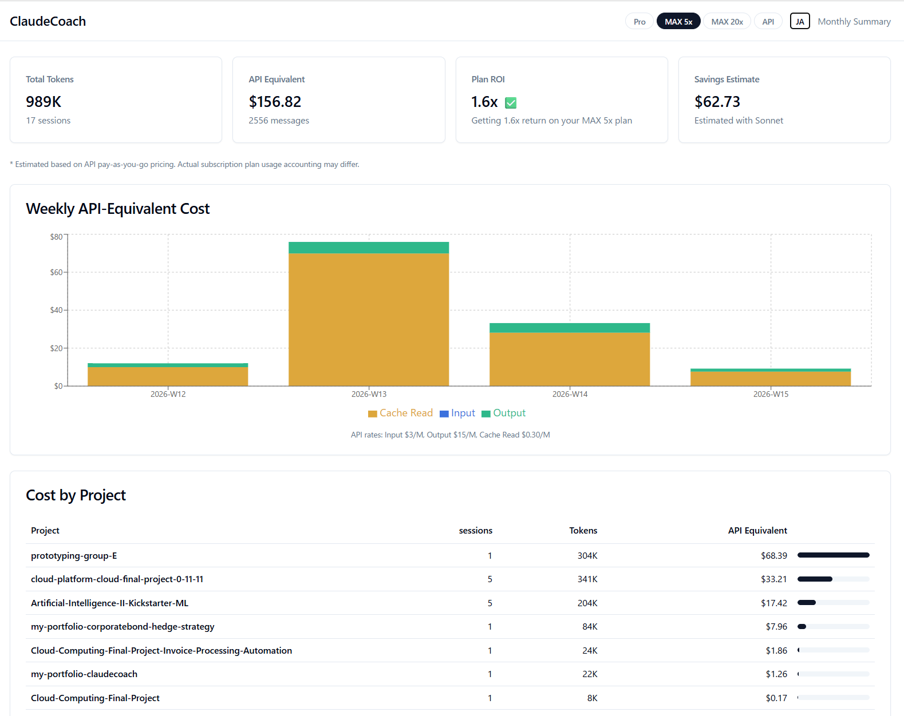
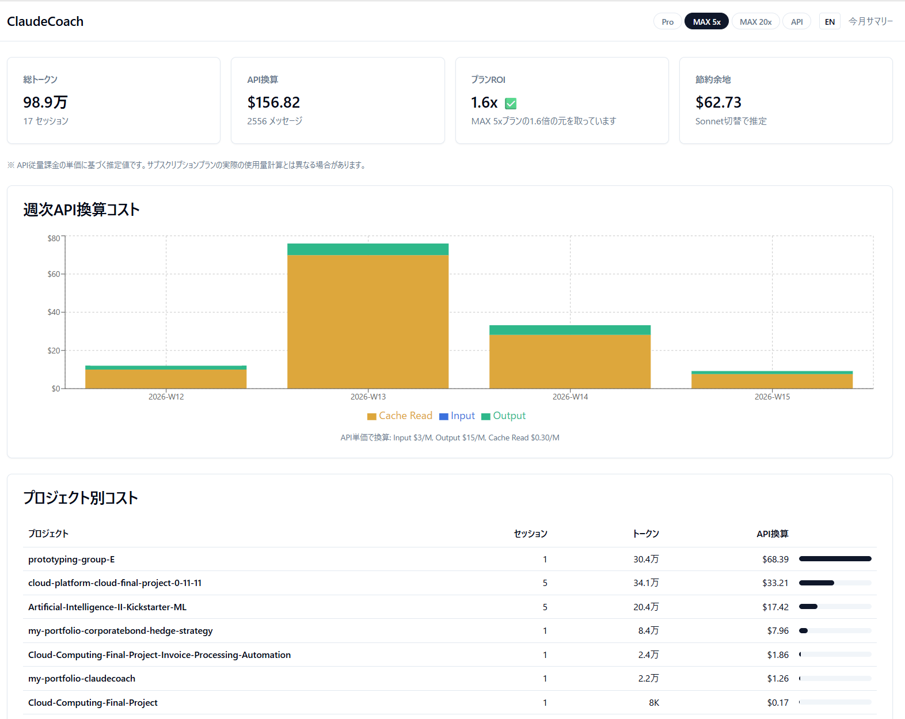

# ClaudeCoach

**Claude Codeのトークン使用量を可視化し、改善提案を行うローカルダッシュボード**

**A local dashboard that visualizes Claude Code token usage and provides optimization suggestions**

## Quick Start / すぐに使う

```bash
git clone https://github.com/HiroakiNakano1985/claudecoach.git
cd claudecoach
bash setup.sh                              # Install all dependencies
python -m agent.cli ingest                 # Ingest your Claude Code logs
uvicorn server.main:app --port 8000 &      # Start backend
cd web && npm run dev &                    # Start frontend
# → Open http://localhost:3000
```

---

## Features / 機能

- **Token Usage Dashboard** / トークン使用量ダッシュボード
  - Weekly token trend chart / 週次トレンドグラフ
  - Per-project cost breakdown / プロジェクト別コスト内訳
- **Plan ROI Calculation** / プランROI計算
  - Auto-detects your plan (Pro / Max 5x / Max 20x / API) / プラン自動検出
  - Shows API-equivalent cost and ROI ratio / API換算コスト・ROI倍率表示
  - *Note: ROI is estimated based on API pay-as-you-go pricing. Actual subscription plan usage accounting may differ.*
  - *※ ROIはAPI従量課金の単価に基づく推定値です。サブスクリプションプランの実際の使用量計算とは異なる場合があります。*
- **Privacy-First** / プライバシー重視
  - Runs entirely on localhost / 完全ローカル動作
  - Only extracts metadata (token counts, timestamps) — never stores conversation content / メタデータのみ抽出、会話内容は一切保存しません

## Screenshots / スクリーンショット

**English**



**Japanese / 日本語**



## Tech Stack / 技術スタック

| Layer | Technology |
|-------|-----------|
| Backend | Python 3.10+ / FastAPI / JSON Database |
| Frontend | Next.js 14 / Tailwind CSS / shadcn/ui / Recharts |
| CLI | Python (`claudecoach ingest`) |

## Getting Started / セットアップ

### Prerequisites / 前提条件

- Python 3.10+
- Node.js 18+
- Claude Code installed (`~/.claude/projects/` directory exists)

### Configuration / 設定

`setup.sh` auto-creates `.env` from `.env.example`. Edit if needed:

`setup.sh`が`.env.example`から`.env`を自動作成します。必要に応じて編集してください:

```env
CLAUDE_PROJECTS_PATH=~/.claude/projects   # Path to Claude Code logs
CLAUDE_PLAN=auto                           # auto / pro / max_5x / max_20x / api
```

## Project Structure / ディレクトリ構成

```
claudecoach/
├── agent/              # CLI & JSONL parser / CLIとログパーサー
│   ├── cli.py
│   └── parser.py
├── server/             # FastAPI backend / バックエンドAPI
│   ├── main.py
│   ├── database.py
│   ├── models/
│   ├── routers/
│   └── services/
│       └── plan_service.py   # Plan detection & ROI / プラン検出・ROI計算
└── web/                # Next.js frontend / フロントエンド
    └── src/
        ├── app/
        ├── components/
        └── lib/
```

## API Endpoints / APIエンドポイント

| Method | Path | Description |
|--------|------|-------------|
| GET | `/api/health` | Health check |
| GET | `/api/dashboard` | Dashboard summary with ROI / ダッシュボードサマリー |
| GET | `/api/roi` | ROI calculation / ROI計算 |
| GET | `/api/plan` | Plan auto-detection / プラン自動検出 |
| GET | `/api/sessions` | Session list / セッション一覧 |
| GET | `/api/sessions/{id}` | Session detail / セッション詳細 |
| POST | `/api/sessions/ingest` | Ingest session data / セッションデータ取込 |

## Roadmap / ロードマップ

- [x] **Phase 1**: Data ingestion, dashboard, plan detection & ROI
- [ ] **Phase 2**: Pattern analysis, Haiku-powered improvement suggestions
- [ ] **Phase 3**: File watcher (auto-ingest), subscription & deployment

## Pricing / 料金

ClaudeCoach is currently **free and open source**.

In the future, when we introduce cloud-hosted features (AWS deployment, automated weekly reports via Paperclip AI, etc.), a paid subscription plan will be offered. The core local functionality will remain free.

現在ClaudeCoachは**無料・オープンソース**です。

将来的にクラウド機能（AWSデプロイ、Paperclip AIによる週次レポート自動化など）を導入する際に、有料サブスクリプションプランを提供予定です。ローカルで動作するコア機能は引き続き無料です。

## Disclaimer / 免責事項

ClaudeCoach is an independent project and is **not affiliated with, endorsed by, or associated with Anthropic or Claude in any way**. "Claude" is a trademark of Anthropic, PBC.

ClaudeCoachは独立したプロジェクトであり、**Anthropic社およびClaudeとは一切関係ありません**。「Claude」はAnthropic, PBC の商標です。

## License / ライセンス

MIT
